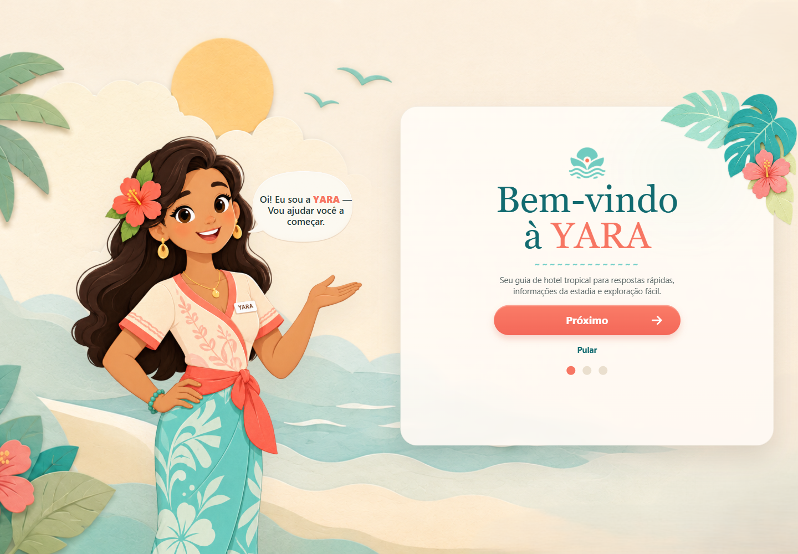
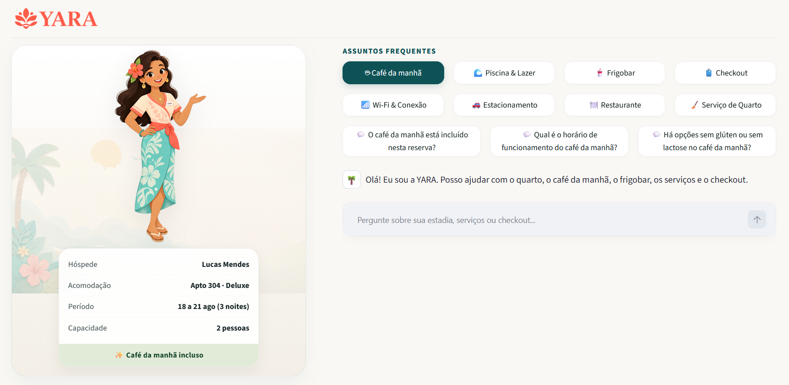

# YARA

<table align="center">
  <tr>
    <td align="center" valign="middle">
      
    </td>
    <td align="center" valign="middle">
      
    </td>
  </tr>
</table>

<p align="center">
  
  
  
  
  
  

</p>


<p align="center">
  <a href="#objetivo-do-projeto">Objetivo</a> |
  <a href="#visao-rapida">Visao rapida</a> |
  <a href="#showcase">Showcase</a> |
  <a href="#arquitetura-do-mvp">Arquitetura</a> |
  <a href="#fluxo-funcional">Fluxo</a> |
  <a href="#tecnologias-utilizadas">Tecnologias</a> |
  <a href="#exemplo-de-interacao">Exemplo</a> |
  <a href="#como-rodar-o-projeto-localmente">Como rodar</a> |
  <a href="#dados-estruturados-e-pdfs">Dados</a>
</p>

YARA e um assistente virtual de hotel com apresentacao em React/Vite e demo funcional em Streamlit. O MVP combina dados estruturados de reservas com busca semantica sobre PDFs do hotel para responder perguntas contextualizadas. O repositorio foi desenvolvido com apoio do Codex para acelerar a implementacao, a documentacao e a validacao do fluxo.

## Objetivo do projeto

O objetivo da YARA e demonstrar como um hotel pode usar IA para responder duvidas de hospedes com contexto real da operacao. Em vez de depender apenas de uma resposta generica do modelo, a demo combina informacoes estruturadas da reserva com documentos internos do hotel, como politicas de hospedagem, servicos, cafe da manha, frigobar, estacionamento e limpeza.

Com isso, o assistente consegue responder perguntas praticas sobre a estadia atual e sobre regras do hotel mantendo o fluxo rastreavel: os CSVs fornecem os fatos operacionais e os PDFs processados fornecem o contexto documental.

## Visao rapida

| Area | Estado atual |
| --- | --- |
| Experiencia | Frontend de apresentacao com CTA para a demo |
| Chat | Streamlit em `backend/api/app.py` |
| Dados operacionais | CSVs em `data/csv` |
| Base documental | 10 PDFs em `data/raw`, Markdown em `data/processed` |
| RAG | 77 chunks, embeddings e metadados em `data/index` |
| IA | Embeddings e LLM via OpenRouter |

## Links publicados

- Frontend: https://yara.joham.workers.dev/
- Demo Streamlit: https://yara-hotel-assistant.streamlit.app

## Showcase

<table>
  <tr>
    <td width="50%">
      
    </td>
    <td width="50%">
      
    </td>
  </tr>
  <tr>
    <td>Intro publicada em React/Vite</td>
    <td>Demo Streamlit</td>
  </tr>
</table>

## Arquitetura do MVP

```mermaid
%%{init: {"theme": "base", "themeVariables": {"background": "transparent", "mainBkg": "#0f172a", "primaryTextColor": "#f8fafc", "lineColor": "#94a3b8", "fontFamily": "Inter, ui-sans-serif, system-ui, sans-serif"}}}%%
flowchart LR
    %% Fluxo online: o usuario pergunta e a YARA combina dados estruturados + RAG.
    U["Usuario"] --> FE["Intro React/Vite"]
    FE --> APP["Demo Streamlit"]
    APP --> Q["Pergunta do chat"]

    Q --> CSV["Dados da reserva<br/>CSVs em data/csv"]
    Q --> RAG["Busca documental<br/>indice em data/index"]

    CSV --> CTX["Contexto da resposta"]
    RAG --> CTX
    CTX --> LLM["OpenRouter LLM"]
    LLM --> OUT["Resposta da YARA<br/>no Streamlit"]

    %% Fluxo offline: os documentos alimentam o indice usado pelo RAG.
    PDF["PDFs do hotel<br/>data/raw"] --> PREP["Pipeline offline<br/>PDF -> Markdown -> chunks -> embeddings"]
    PREP --> IDX[("Indice RAG<br/>data/index")]
    IDX --> RAG

    classDef app fill:#123047,stroke:#60a5fa,stroke-width:1.5px,color:#f8fafc
    classDef data fill:#12382b,stroke:#34d399,stroke-width:1.5px,color:#f8fafc
    classDef rag fill:#2f2454,stroke:#a78bfa,stroke-width:1.5px,color:#f8fafc
    classDef llm fill:#4a2613,stroke:#fb923c,stroke-width:2px,color:#f8fafc
    classDef output fill:#12382b,stroke:#34d399,stroke-width:2px,color:#f8fafc

    class FE,APP,Q app
    class CSV data
    class RAG,PDF,PREP,IDX rag
    class CTX,LLM llm
    class OUT output
```



A arquitetura do MVP separa a experiencia de entrada, os dados estruturados e a recuperacao documental. O frontend em React/Vite funciona como apresentacao e leva o usuario para a demo em Streamlit, onde a conversa acontece.

No fluxo online, cada pergunta consulta duas fontes antes de chamar o modelo: os CSVs em `data/csv`, que guardam os fatos da reserva e dos servicos, e o indice RAG em `data/index`, que guarda os trechos recuperaveis dos PDFs do hotel. Esses dois contextos sao reunidos em um prompt unico e enviados ao OpenRouter para gerar a resposta exibida no chat.

O fluxo offline prepara a base documental usada pelo RAG. Os PDFs em `data/raw` sao convertidos para Markdown com Docling, quebrados em chunks, enriquecidos com metadados e transformados em embeddings. O resultado fica versionado em `data/index` para que a demo consulte esse indice durante a conversa.

## Fluxo funcional

| # | Etapa | O que acontece |
| --- | --- | --- |
| 1 | Entrada pela intro | O usuario acessa a apresentacao React/Vite e segue para a demo publicada em Streamlit. |
| 2 | Pergunta no chat | A demo recebe a duvida do usuario em `backend/api/app.py`. |
| 3 | Consulta aos CSVs | Os dados em `data/csv` identificam fatos da reserva, do quarto e dos servicos cadastrados. |
| 4 | Busca documental | O indice em `data/index` recupera trechos relevantes dos PDFs processados. |
| 5 | Montagem de contexto | Os fatos estruturados e os trechos documentais sao reunidos em um prompt unico. |
| 6 | Resposta com IA | O OpenRouter gera a resposta final exibida no chat da YARA. |

Esse fluxo evita que o modelo responda a partir da pergunta isolada. A resposta sempre passa antes pela camada de dados estruturados e pela recuperacao documental do hotel.

## Tecnologias utilizadas

| Tecnologia | Funcao |
| --- | --- |
| React/Vite | Intro publicada e ponto de entrada visual para a demo |
| Streamlit | Interface funcional do chat da YARA |
| Python | Scripts, processamento de dados e backend da demo |
| OpenRouter | Geracao de embeddings e respostas com LLM |
| Docling | Conversao dos PDFs do hotel para Markdown |
| NumPy | Armazenamento local dos embeddings em `data/index` |
| CSV | Base operacional de quartos, reservas e servicos |
| Mermaid | Diagrama da arquitetura do MVP no README |

## Exemplo de interacao

| Usuario | YARA |
| --- | --- |
| `O cafe da manha esta incluido na minha reserva?` | Consulta os dados da reserva em `data/csv` e cruza com as regras do documento de cafe da manha antes de responder. |
| `Meu quarto tem frigobar?` | Usa os dados do quarto cadastrado e os documentos sobre comodidades para explicar a disponibilidade. |
| `Como funciona o estacionamento?` | Recupera os trechos do PDF de estacionamento e responde com as regras relevantes para o hospede. |

## Como rodar o projeto localmente

1. Crie o arquivo `.env` a partir de `.env.example` e informe sua `OPENROUTER_API_KEY`.
   Se quiser, ajuste também `VITE_STREAMLIT_URL` e `VITE_DEMO_SCENARIO_ID`.

2. Instale as dependencias do frontend:

```bash
npm install
```

3. Instale as dependencias Python do demo:

```bash
py -3 -m pip install -r requirements.txt
```

4. Gere ou atualize o indice RAG com os PDFs em `data/raw`:

```bash
py -3 backend/scripts/build_rag_index.py
```

5. Rode tudo com um comando na raiz do projeto:

```bash
npm run dev:all
```

Esse comando sobe o frontend React/Vite e a demo Streamlit ao mesmo tempo. Se quiser apenas o frontend, use `npm run dev`. Se quiser apenas o Streamlit, use `npm run dev:streamlit`.

## Dados estruturados e PDFs

Os CSVs representam a base operacional do hotel:

- `rooms.csv`
- `reservations.csv`
- `services.csv`

Esses dados entram diretamente no contexto da reserva e permitem responder perguntas como:

- Qual e o quarto da reserva atual?
- O cafe da manha esta incluido?
- O quarto tem frigobar?
- Quais servicos estao cadastrados?

Os PDFs em `data/raw` sao convertidos para Markdown em `data/processed`, quebrados em chunks e indexados em `data/index`. O indice atual foi gerado a partir de 10 documentos e contem 77 chunks:

- `01_guia_geral_yara.pdf`
- `02_politicas_hospedagem_yara.pdf`
- `03_servicos_hotel_yara.pdf`
- `04_cafe_da_manha_yara.pdf`
- `05_piscina_lazer_yara.pdf`
- `06_frigobar_yara.pdf`
- `07_wifi_conectividade_yara.pdf`
- `08_estacionamento_yara.pdf`
- `09_restaurante_room_service_yara.pdf`
- `10_limpeza_quarto_yara.pdf`

## Scripts uteis

- `py -3 backend/scripts/test_csv.py`
- `py -3 backend/scripts/build_rag_index.py`
- `py -3 backend/scripts/test_rag.py`

## Ativos e creditos

Os arquivos de audio usados pela intro e pela demo Streamlit ficam em `public/audio`:

- `Bossa Nova Days.wav`
- `CastlesMadeOutOfSand.wav`
- `Shrimp SambaLOOPED.wav`

Credito: faixas do pacote [SomeWhatGood: Beach](https://flowerheadmusic.itch.io/somewhat-good-beach), de flowerhead.
