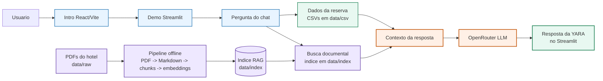

# YARA

<p align="center">
  
</p>

<p align="center">
  <a href="#visao-rapida">Visao rapida</a> |
  <a href="#arquitetura-do-mvp">Arquitetura</a> |
  <a href="#como-rodar-o-projeto-localmente">Como rodar</a> |
  <a href="#dados-estruturados-e-pdfs">Dados</a>
</p>

YARA e um assistente virtual de hotel com apresentacao em React/Vite e demo funcional em Streamlit. O MVP combina dados estruturados de reservas com busca semantica sobre PDFs do hotel para responder perguntas contextualizadas.

## Visao rapida

| Area | Estado atual |
| --- | --- |
| Experiencia | Frontend de apresentacao com CTA para a demo |
| Chat | Streamlit em `backend/api/app.py` |
| Dados operacionais | CSVs em `data/csv` |
| Base documental | 10 PDFs em `data/raw`, Markdown em `data/processed` |
| RAG | 77 chunks, embeddings e metadados em `data/index` |
| IA | Embeddings e LLM via OpenRouter |

## Links publicados

- Frontend: https://yara.joham.workers.dev/
- Demo Streamlit: https://yara-hotel-assistant.streamlit.app

## Arquitetura do MVP



A arquitetura do MVP separa a experiencia de entrada, os dados estruturados e a recuperacao documental. O frontend em React/Vite funciona como apresentacao e leva o usuario para a demo em Streamlit, onde a conversa acontece.

No fluxo online, cada pergunta consulta duas fontes antes de chamar o modelo: os CSVs em `data/csv`, que guardam os fatos da reserva e dos servicos, e o indice RAG em `data/index`, que guarda os trechos recuperaveis dos PDFs do hotel. Esses dois contextos sao reunidos em um prompt unico e enviados ao OpenRouter para gerar a resposta exibida no chat.

O fluxo offline prepara a base documental usada pelo RAG. Os PDFs em `data/raw` sao convertidos para Markdown com Docling, quebrados em chunks, enriquecidos com metadados e transformados em embeddings. O resultado fica versionado em `data/index` para que a demo consulte esse indice durante a conversa.


## Como rodar o projeto localmente

1. Crie o arquivo `.env` a partir de `.env.example` e informe sua `OPENROUTER_API_KEY`.
   Se quiser, ajuste também `VITE_STREAMLIT_URL` e `VITE_DEMO_SCENARIO_ID`.

2. Instale as dependencias do frontend:

```bash
npm install
```

3. Instale as dependencias Python do demo:

```bash
py -3 -m pip install -r requirements.txt
```

4. Gere ou atualize o indice RAG com os PDFs em `data/raw`:

```bash
py -3 backend/scripts/build_rag_index.py
```

5. Rode tudo com um comando na raiz do projeto:

```bash
npm run dev:all
```

Esse comando sobe o frontend React/Vite e a demo Streamlit ao mesmo tempo. Se quiser apenas o frontend, use `npm run dev`. Se quiser apenas o Streamlit, use `npm run dev:streamlit`.

## Dados estruturados e PDFs

Os CSVs representam a base operacional do hotel:

- `rooms.csv`
- `reservations.csv`
- `services.csv`

Esses dados entram diretamente no contexto da reserva e permitem responder perguntas como:

- Qual e o quarto da reserva atual?
- O cafe da manha esta incluido?
- O quarto tem frigobar?
- Quais servicos estao cadastrados?

Os PDFs em `data/raw` sao convertidos para Markdown em `data/processed`, quebrados em chunks e indexados em `data/index`. O indice atual foi gerado a partir de 10 documentos e contem 77 chunks:

- `01_guia_geral_yara.pdf`
- `02_politicas_hospedagem_yara.pdf`
- `03_servicos_hotel_yara.pdf`
- `04_cafe_da_manha_yara.pdf`
- `05_piscina_lazer_yara.pdf`
- `06_frigobar_yara.pdf`
- `07_wifi_conectividade_yara.pdf`
- `08_estacionamento_yara.pdf`
- `09_restaurante_room_service_yara.pdf`
- `10_limpeza_quarto_yara.pdf`

## Scripts uteis

- `py -3 backend/scripts/test_csv.py`
- `py -3 backend/scripts/build_rag_index.py`
- `py -3 backend/scripts/test_rag.py`

## Ativos e creditos

Os arquivos de audio usados pela intro e pela demo Streamlit ficam em `public/audio`:

- `Bossa Nova Days.wav`
- `CastlesMadeOutOfSand.wav`
- `Shrimp SambaLOOPED.wav`

Credito: faixas do pacote [SomeWhatGood: Beach](https://flowerheadmusic.itch.io/somewhat-good-beach), de flowerhead.
