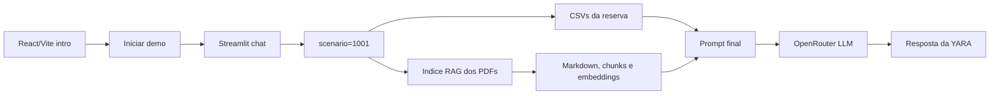

# YARA

<p align="center">
  
</p>

<p align="center">
  <a href="#visao-rapida">Visao rapida</a> |
  <a href="#arquitetura-do-mvp">Arquitetura</a> |
  <a href="#como-rodar-o-projeto-localmente">Como rodar</a> |
  <a href="#dados-estruturados-e-pdfs">Dados</a>
</p>

YARA e um assistente virtual de hotel com apresentacao em React/Vite e demo funcional em Streamlit. O MVP combina dados estruturados de reservas com busca semantica sobre PDFs do hotel para responder perguntas contextualizadas.

## Visao rapida

| Area | Estado atual |
| --- | --- |
| Experiencia | Frontend de apresentacao com CTA para a demo |
| Chat | Streamlit em `backend/api/app.py` |
| Dados operacionais | CSVs em `data/csv` |
| Base documental | PDFs em `data/raw`, Markdown em `data/processed` |
| RAG | Chunks, embeddings e metadados em `data/index` |
| IA | Embeddings e LLM via OpenRouter |

## Arquitetura do MVP

```text
React/Vite intro
  ↓
Streamlit chat
  ↓
CSV estruturado + PDFs do hotel
  ↓
OpenRouter embeddings + LLM
```



O circuito completo do MVP:

```text
Usuario
  ↓
Apresentacao da YARA
  ↓
Iniciar demo
  ↓
Streamlit
  ↓
scenario=1001
  ↓
CSV da reserva
  ↓
PDF -> Markdown -> chunks -> embeddings
  ↓
Top-K similaridade
  ↓
Prompt final
  ↓
OpenRouter LLM
  ↓
Chat da YARA
```

## O que ja esta pronto

- Frontend de apresentacao em `src/components/Intro`
- CTA final que abre a demo do Streamlit
- CSVs estruturados em `data/csv`
- Conversor CSV em `backend/data_processing/csv_loader.py`
- Pipeline PDF -> Markdown em `backend/data_processing/hotel_rag.py`
- Indexacao em `data/index/chunks.jsonl`, `data/index/embeddings.npy` e `data/index/index_meta.json`
- Chat Streamlit com OpenRouter em `backend/api/app.py`

<details>
<summary>Foco atual</summary>

- Manter o caminho completo frontend -> demo -> RAG funcionando localmente.
- Validar respostas a partir do `scenario=1001`.
- Evoluir a experiencia sem separar o frontend da base funcional do MVP.

</details>

## Como rodar o projeto localmente

1. Crie o arquivo `.env` a partir de `.env.example` e informe sua `OPENROUTER_API_KEY`.
   Se quiser, ajuste também `VITE_STREAMLIT_URL` e `VITE_DEMO_SCENARIO_ID`.

2. Instale as dependencias do frontend:

```bash
npm install
```

3. Instale as dependencias Python do demo:

```bash
py -3 -m pip install -r requirements.txt
```

4. Gere ou atualize o indice RAG com os PDFs em `data/raw`:

```bash
py -3 backend/scripts/build_rag_index.py
```

5. Rode tudo com um comando na raiz do projeto:

```bash
npm run dev:all
```

Esse comando sobe o frontend React/Vite e a demo Streamlit ao mesmo tempo. Se quiser apenas o frontend, use `npm run dev`.

## Dados estruturados e PDFs

Os CSVs representam a base operacional do hotel:

- `rooms.csv`
- `reservations.csv`
- `services.csv`

Esses dados entram diretamente no contexto da reserva e permitem responder perguntas como:

- Qual e o quarto da reserva atual?
- O cafe da manha esta incluido?
- O quarto tem frigobar?
- Quais servicos estao cadastrados?

Os PDFs em `data/raw` sao convertidos para Markdown, quebrados em chunks e indexados em `data/index`:

- `hotel_guide.pdf`
- `policies.pdf`
- `services.pdf`

## Scripts uteis

- `py -3 backend/scripts/test_csv.py`
- `py -3 backend/scripts/build_rag_index.py`
- `py -3 backend/scripts/test_rag.py`

## Fluxo atual

```text
CSV da reserva + PDFs do hotel
  ↓
Markdown + chunks
  ↓
Embeddings OpenRouter
  ↓
Similarity search
  ↓
Prompt final
  ↓
OpenRouter LLM
  ↓
Streamlit chat
```
